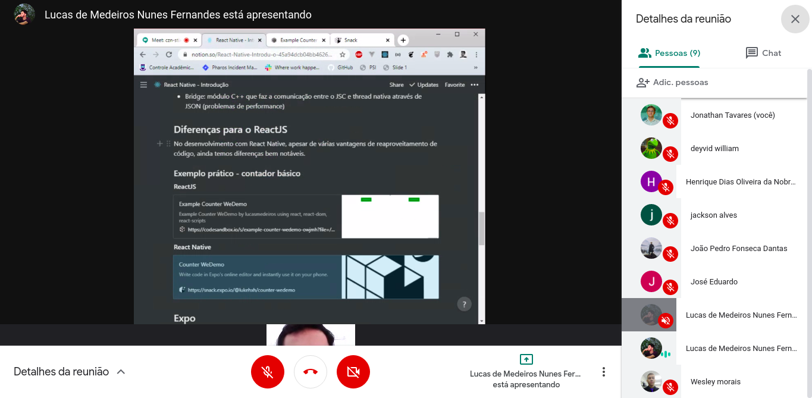

# Quarto MeetUp - Dev Seridó

- [x] Quando aconteceu?

- 23/jul do ano de 2020 das 15h às 16h

- [x] Onde aconteceu?

- No [Google Meet](https://meet.google.com/czn-stix-imm)

- [x] O que foi abordado?

- Introdução ao funcionamento do React Native
- Diferenças entre tipos de aplicação (Web Apps/PWAs/Hibridos/Nativos)
- Comparação entre ReactJS e React Native

- [x] O que foi produzido?

 - [Anotações React Native - Notion](https://www.notion.so/React-Native-Introdu-o-45a94dcb04bb46269298a2c238d3ba16)

- [x] Links Importantes 

 1. [Site Oficial do React Native](https://reactnative.dev/)

- [x] Quem participou?

- Jonathan Tavares 
- João Pedro Fonseca
- José Eduardo
- Lucas Medeiros
- Wesley Vitor
- Jackson Alves
- Deyvid Willian
- Henrique Lopes
